## Introduction

Healthcare insurance costs can vary widely between individuals, and personal lifestyle and demographic factors often explain these differences. Variables such as Age, BMI, smoking status, Number of Dependents, Sex, and Region may all play a role in shaping how much an individual is charged for medical insurance.

The purpose of this project is to explore which factors are most strongly associated with higher healthcare insurance charges. Using exploratory data analysis in R, our team examined trends, distributions, correlations, and interactions between variables in the dataset. Rather than focusing on only one factor at a time, we also examined how variables such as smoking status, BMI, and age interact to influence insurance costs, since it is often a combination of factors that drives insurance costs more than a single variable.

Overall, this project uses data visualization techniques and effective statistical summaries to better understand the major patterns behind healthcare insurance charges.

## Description of the Data

The dataset used for this project was obtained from Kaggle and contains information on healthcare insurance costs and several personal demographic and lifestyle-variables such as Age, Sex, BMI, Number of Dependents and Smoking Status.

Dataset Source:
https://www.kaggle.com/datasets/willianoliveiragibin/healthcare-insurance

The dataset contains 1,338 observations and 7 variables, including both numerical (age, BMI, number of children, and insurance charges) and categorical (sex, smoking status, and region) variables.

The variables included in the dataset are:

| Variable | Description |
|---|---|
| age | Age of the insured individual |
| sex | Gender (male or female) of the insured individual |
| bmi | Body Mass Index: A measure of body fat based on height and weight. |
| children | Number of dependents covered by insurance |
| smoker | Smoking status (yes or no) of the insured individual |
| region | Geographic region associated with the insurance record |
| charges | The medical insurance costs incurred by the insured person. |

Before beginning the analysis, the dataset was inspected for missing values, variable types, and general structure. Several categorical variables were converted into factors to improve  visualization and exploratory analysis. Additional grouped variables and summary comparisons were also created throughout the project to better analyze interactions between variables such as smoking status, BMI, and age.

## Research Questions

In order to understand how insurance charges can be affected by the variables in the dataset, we decided to ask 8 main questions from the data collected:

1)	Age and Charges - Is there a relationship between age and insurance charges?

2)	Sex and Charges – Do insurance charges differ by sex?

3)	BMI and Charges - Is there a relationship between BMI and insurance charges, and is there a threshold where charges increase significantly?

4)	Smoker and Charges - Does smoking increase insurance charges?

5)	Children and Charges - Does insurance cost change with the number of dependents?

6)	Region and Charges - Are insurance charges greater in certain regions?

7) Age and Smoking- Are older smokers charged more than those younger?

8) Smoking and region- Do smokers in certain regions get charged more?

Our work throughout the project focuses on answering these main questions by analyzing the dataset.

## Methods and Analytical Approach

The analysis was completed using R and RMarkdown. Several visualization and exploratory analysis techniques were used throughout the project.

### The packages we used:

- tidyverse
- ggplot2
- corrplot

### The analytical techniques we used:

- Scatterplots
- Boxplots
- Violin plots
- Correlation matrices
- Faceted visualizations
- Distribution comparisons

### Graphing and Visualization techniques we used:

- Customized axis labels
- Cohesive color schemes (utilizing polishing plots techniques)
- Trend lines
- Grouped visualizations
- Faceted comparisons
- Simplified layouts for presentations

## Exploratory Data Analysis & Findings:

Before answering any of our questions, we wanted to ensure the data was clean. Our data contained no NA values or duplicates, so we were able to proceed to the next step.

Before diving deeper into the analysis, we wanted to provide a brief overview of the relationships between individual variables and health insurance costs. Thus, we used a correlation matrix and a heatmap. To do so, we changed all non-numerical categorical variables to factors and created a heatmap.

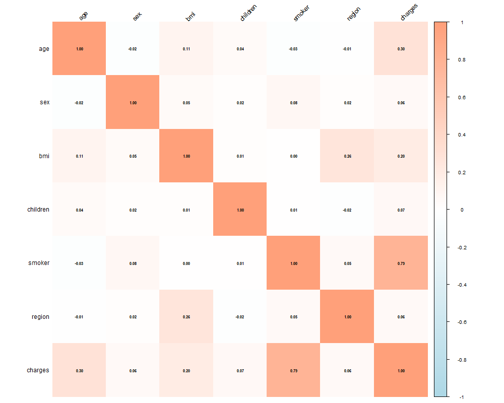

Although the correlation matrix and heatmap show that smoking status has the strongest positive relationship with insurance charges, age and BMI also display moderate positive relationships with insurance cost. In contrast, variables such as sex, region, and number of children appear to have relatively weak relationships with insurance charges overall.

The heatmap also suggests that no single variable alone perfectly explains insurance costs. Instead, insurance charges are likely influenced by multiple interacting demographic and lifestyle-related factors. This led us to further investigate how variables such as smoking status, BMI, and age interact with one another throughout the project.

### Smoking Status and Insurance Charges

Although the data we collected contains significantly more non-smokers than smokers, our analysis showed that smoking status had one of the strongest relationships with healthcare insurance charges in the dataset. Smokers consistently displayed substantially higher insurance costs compared to non-smokers across nearly every visualization used in the project.

The boxplots and distribution comparisons showed that smokers not only had higher median insurance charges but also much greater variability and more extreme outliers. This suggests that smoking may significantly increase long-term healthcare expenses and associated insurance costs.

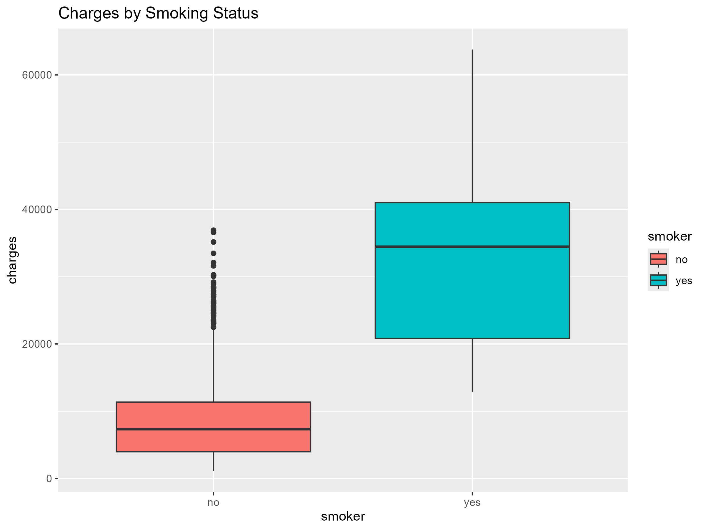

Additionally, smoking status became even more important when combined with other variables such as BMI and age, suggesting that smoking amplifies the effects of other health-related factors.

### Age and Insurance Charges

The scatterplots comparing age and insurance charges showed a clear positive relationship between the two variables. In general, insurance costs tended to increase as individuals became older.

Although the relationship was not perfectly linear, older individuals consistently experienced higher insurance charges overall. The visualizations also showed that age alone could not fully explain insurance costs, since some younger individuals still experienced unusually large insurance charges.

When smoking status was incorporated into the analysis, the separation between smokers and non-smokers became much clearer, especially among older individuals. Smokers had higher base charges, which continued to increase as smokers got older. Non-smokers had a lower base charge, but charges still increased with age. Interestingly, there was a higher correlation between non-smokers, age and charges than smokers, ages, and charges. 

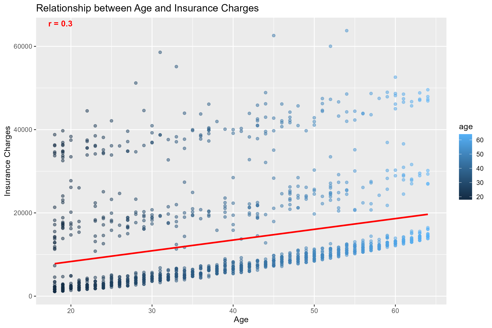

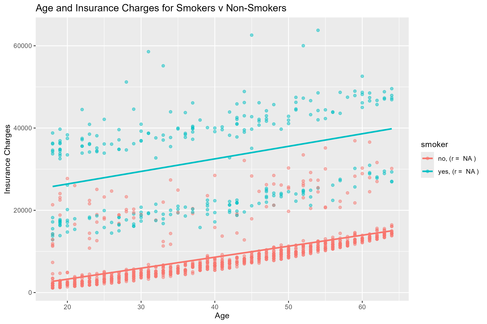

Overall, we see that insurance charges increased with age, indicating a positive relationship. We also saw that older smokers had higher charges than younger smokers. 

## Sex and Charges

Our data contains a very similar amount of males and females, an important note for our analysis of the effect sex has insurance charges. Overall, males and females are charged at similar rates. Men have slightly higher charges and a slightly greater IQR, but the distributions between males and females are very similar.

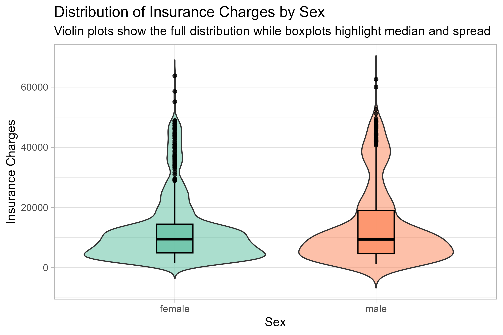

Due to overlap in the distributions between males and females, we wanted to look closer to see whether smoking had a major effect on the charges between the sexes. Based on our faceted blox plots, we see that smokers, regardless of sex, are charged more. However, there is practically no difference between the insurance charges of males and females for both smokers and non-smokers. 

## BMI, thresholds, and Charges

To better see the relationship between BMI and charges, we grouped by smoking status. Our scatterplot shows that for non-smokers, insurance charges remained relatively low across all BMI values. For smokers, we can see that as BMI increases, charges also increase.

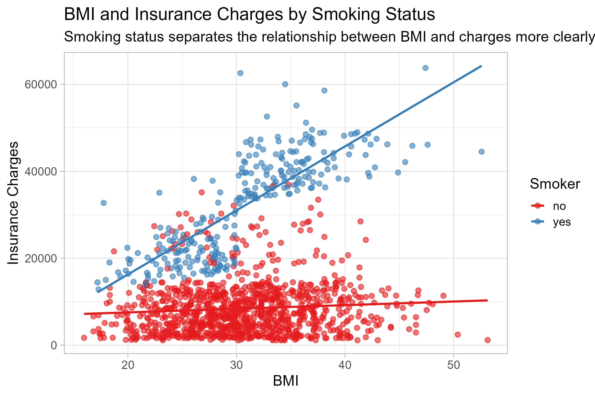

To evaluate whether there was a threshold at which costs increased significantly, we created box plots for smokers and non-smokers above and below the BMI of 30. We chose 30 as the threshold because in the United States, a BMI of 30 or above is considered obese. 

From our box plots, we can see that those with a BMI of 30 or above generally experience higher insurance charges than those with a BMI below 30. Those above the threshold also had a higher range and IQR of charges.

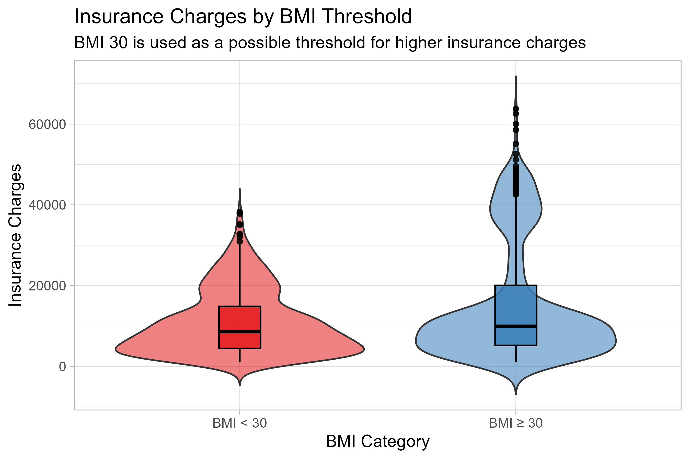

## Charges and Children

To evaluate the relationship between the number of children in a family and insurance charges, we created boxplots of the 6 groups in the data. We see that families with 4 children have the highest median charges, and that the relationship between charges and number of children is positive for those with 1-4 children.

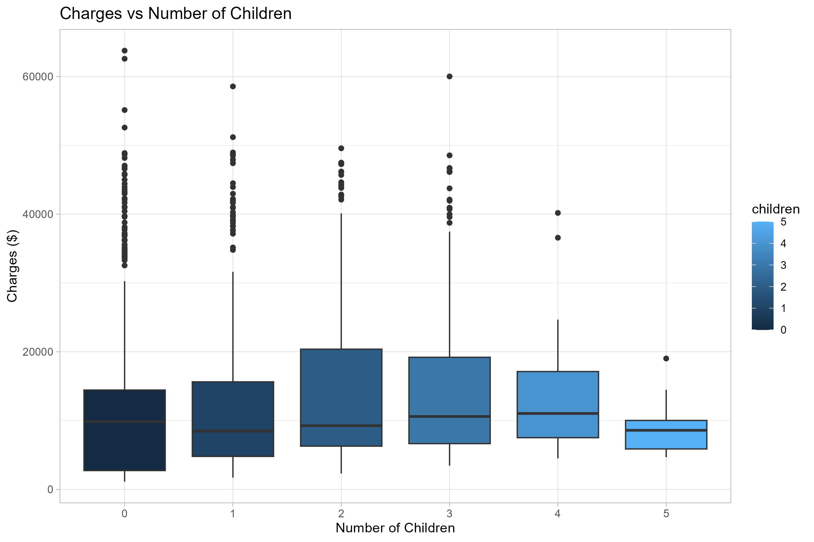

Interestingly, we see that those with 5 children have the lowest median insurance charges, and the lowest variability. This could be due to a lack of families in the data with 5 children, leading to a lower representation of the population with 5 children. 

## Regions and Charges

Our data showed a fairly even spread of families across all 4 regions.

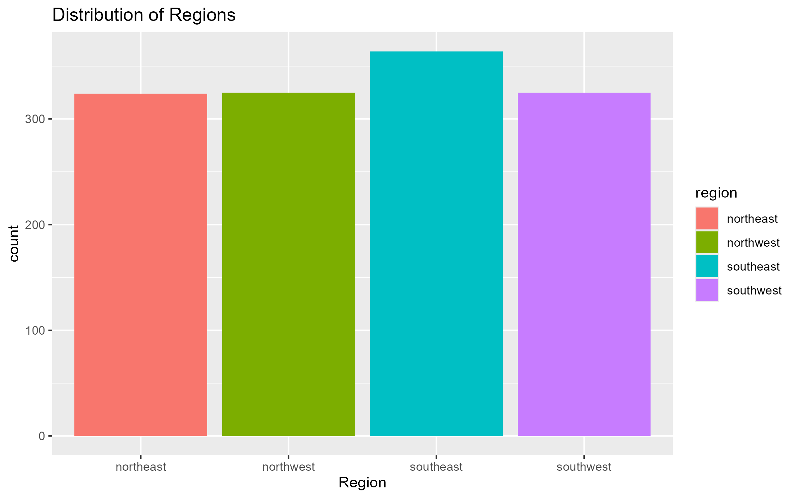

In comparing the charges by region, we see that all distributions were very similar. 

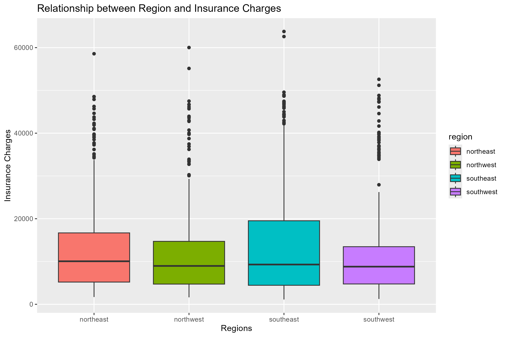

The southeast had a slightly greater IQR and median charge than any other region, which makes sense, since many people move to the southeast after retiring. 

As seen from our earlier study, as age increases, insurance charges increase. This could be why the southeast has greater variability in charges. 

We also investigated whether a specific region of smokers were charged more than others. To do so, we compared the distributions of insurance charges of smokers in each region with those of non-smokers.

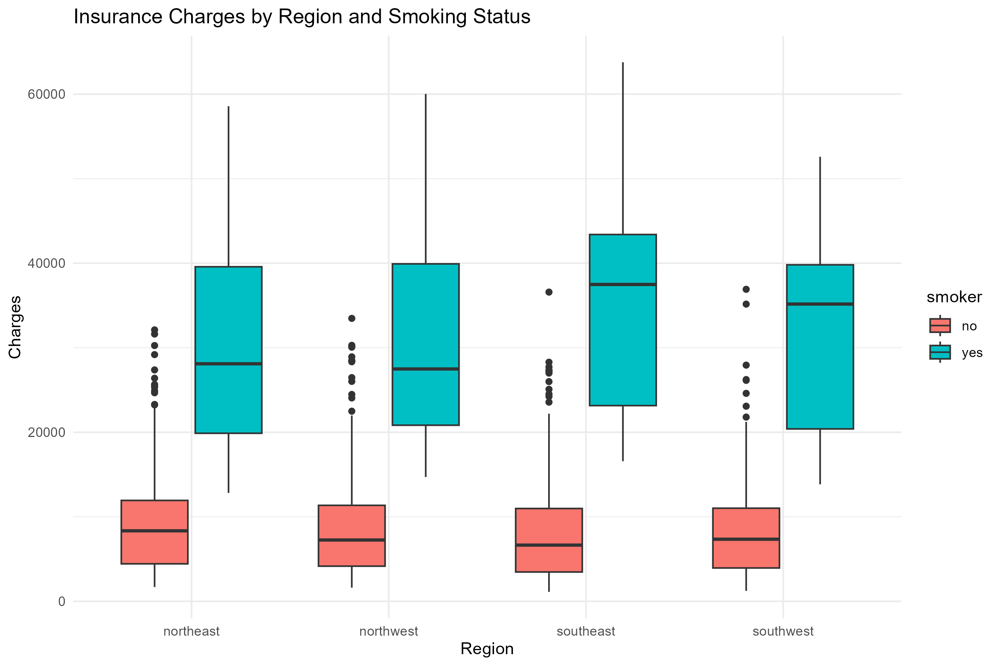

As expected, non-smokers were charged less in all regions than smokers, and their distributions were roughly the same across regions. For smokers, those in the South had greater median charges than those in the North, but similar variability.

We can conclude that smokers in the South are charged slightly more, but insurance charges of smokers do not change very much across regions.

## Key Takeaways

Overall, smoking status appeared to be the strongest predictor of healthcare insurance charges throughout the project. Smokers consistently experienced much higher insurance costs than non-smokers across nearly every visualization. Age and BMI also showed positive relationships with insurance charges, especially among smokers and individuals with BMI values above 30.

While variables such as sex and region showed some differences in distributions, their effects were relatively small compared to smoking status, age, and BMI. Overall, the project demonstrated that insurance charges are influenced by multiple interacting lifestyle and demographic factors rather than a single variable alone.

## Criticisms, Limitations, and Possible Improvements

Although the dataset helped reveal several important relationships, the analysis still contains some limitations. First, the dataset only contained 1,338 observations, which may not fully represent the broader population. Some groups, such as families with five children, had relatively few observations, which may have affected certain trends in the visualizations.

Additionally, the dataset did not contain information about specific diseases, illnesses, medical history, or other health conditions of individuals. Including this information could have helped explain insurance costs more accurately.

The dataset also only included BMI values rather than separate height and weight measurements. Having access to individual height and weight variables could have allowed for a more detailed analysis of obesity and body composition.

Finally, while several strong correlations and trends were identified throughout the project, correlation does not necessarily imply causation. Some variables may appear related because of other underlying factors not included in the dataset.
